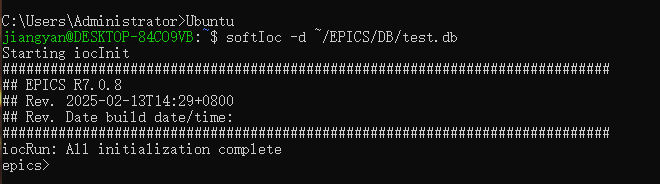
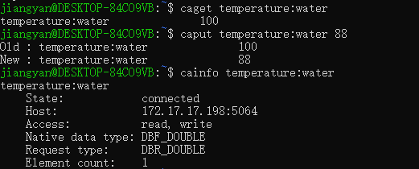

# EPICS-MCP-Server
# Overview
- The EPICS MCP Server is a Python-based server designed to interact with EPICS (Experimental Physics and Industrial Control System) process variables (PVs). It provides a set of tools to retrieve PV values, set PV values, and fetch detailed information about PVs. The server is built 
  using the mcp framework and communicates over stdio, making it suitable for integration into larger control systems or workflows.

- This tool is particularly useful in environments where EPICS PVs are used for monitoring and controlling hardware or software parameters.

# Features
- The EPICS MCP Server provides the following tools:

1. **get_pv_value**
   - Create or update a single file in a repository
   - Inputs:
     - `pv_name` (string): The name of the PV variable.
   - Returns: A JSON object containing the status (`success` or `error`) and the retrieved value or an error message.

2. **set_pv_value**
   - Set a new value for a specified PV.
   - Inputs:
     - `pv_name` (string): The name of the PV variable.
     - `pv_value` (string): The new value to be set for the PV.
   - Returns: A JSON object containing the status (`success` or `error`) and a confirmation message or an error message.

3. **get_pv_info**
   - Fetches detailed information about a specified PV.
   - Inputs:
     - `pv_name` (string): The name of the PV variable.
   - Returns: A JSON object containing the status (`success` or `error`) and the detailed information about the PV or an error message.
  
# Usage with Langchain
- To use this with Langchain, you must install langchain_mcp_adapter
- ### Langchain

```json
server_params = StdioServerParameters(
    command="python",
    # Make sure to update to the full absolute path to your math_server.py file
    args=["/path/server.py"],
)
```
- Before using the EPCIS mcp server, you must successfully install EPCIS on your local machine, ensure that IOC can start normally, and verify that functions such as `caget`, `caput`, and `cainfo` are working properly. For detailed installation instructions, please refer to [https://epics-controls.org/resources-and-support/base/](https://epics-controls.org/resources-and-support/base/).
- 
- 
